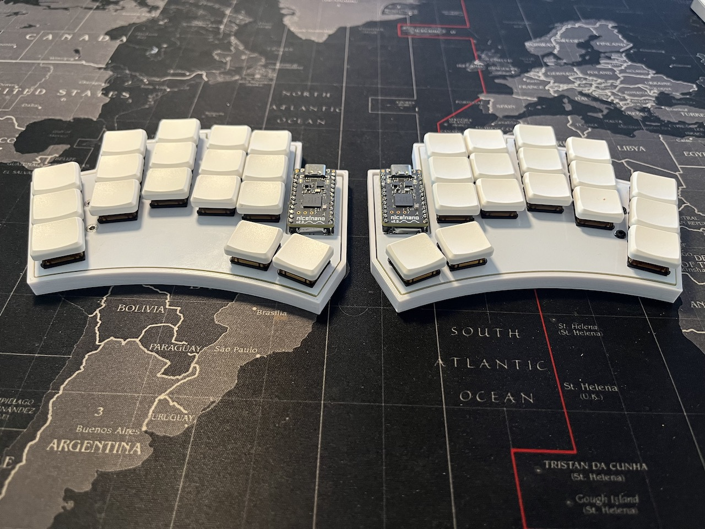
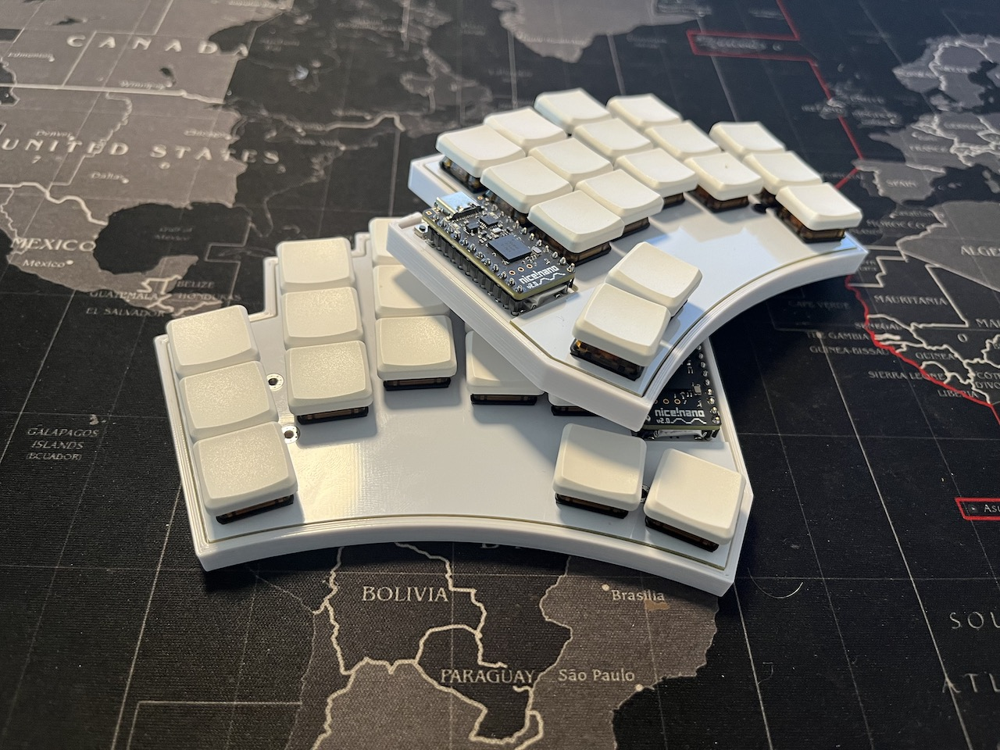
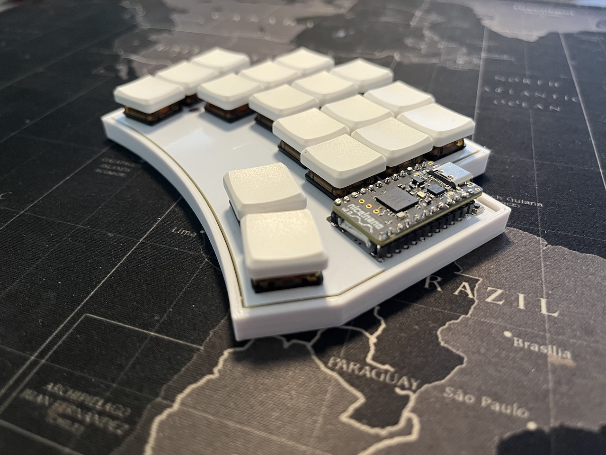

# LambBT
## Split wireless keyboard

A small 34 key split wireless keyboard with Choc V1 switches heavily inspired by the Sweep family and Architeuthis dux.

The keyboard uses hotswap and a top plate together with a 3D printed case with M2 insets. 

Socketing the Nice!Nano v2 allows the battery to fit under the MCU. 

I opted to skip an external battery JST connector and instead use two battery holes to solder the wires. On/Off switch with a case cutout and a reset switch that wont be accidentally triggered.

## Design

Designed from the ground up using Ergogen and the routing in KiCad. Files for the pcb and case are in the [Ergogen](ergogen) folder together with ready made gerber files for both the pcb and plate.

Stl-files for the case are in the [output/case](ergogen/output/cases) folder.

## Build

To build for yourself, mae sure Ergogen CLI is installed. Then download/clone this repo, stand in the ergogen folder and issue the `ergogen .` command.

To also generate the case files, use the full:
`ergogen . && for i in output/cases/*.jscad; do npx @jscad/cli@1 "$i" -of stla ; done`
